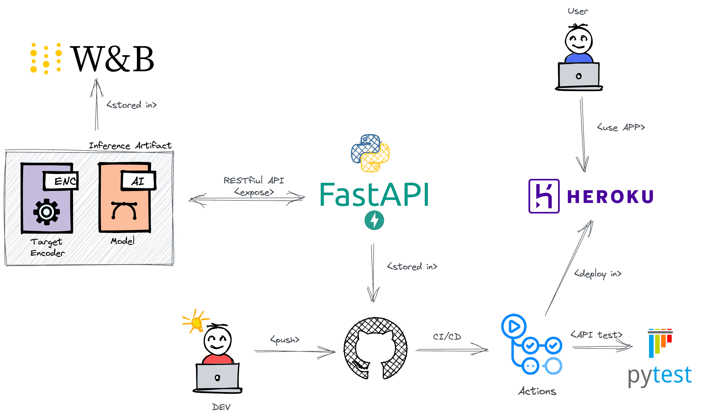
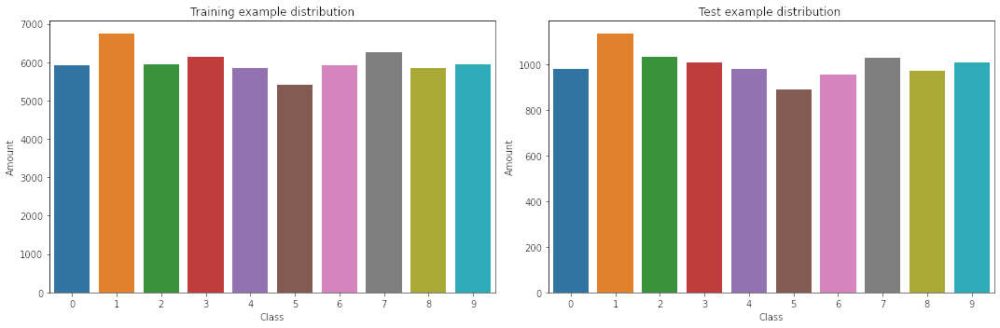
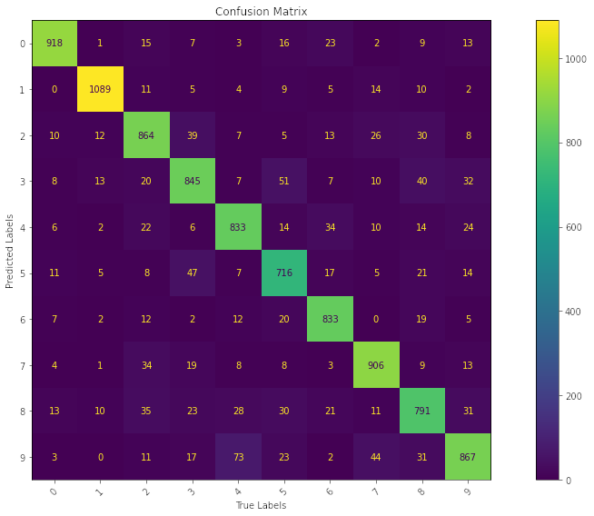
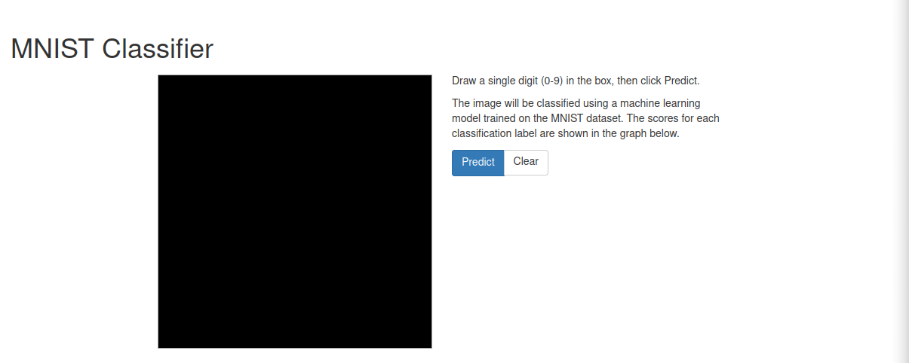
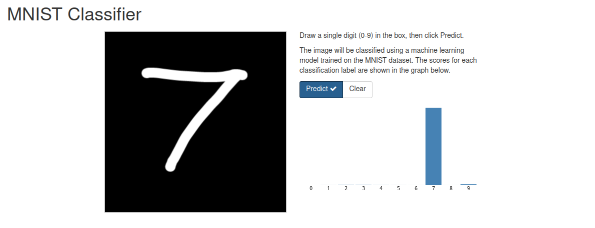

# Using MNSIT data to train and deploy a classification model 

### Graduate Program in Electrical and Computer Engineering

#### Department of Computer Engineering and Automation 

##### EEC1509 Machine Learning

This repo is a test suite for the skills acquired in the [Machine Learning Fundamentals and Decision Trees](https://github.com/ivanovitchm/ppgeecmachinelearning/tree/main/lessons/week_02/sources) lesson to deploy a classification model on the publicly available [MNIST](http://yann.lecun.com/exdb/mnist/) dataset.

The main goal of this work is to deploy a model using the [FastAPI](https://fastapi.tiangolo.com/) module, creating an API and tests. The API tests are going to be incorporated into a CI/CD framework using GitHub Actions. The live API will be deployed using [Heroku](https://www.heroku.com/). [Weights & Biases](https://wandb.ai/) will be used to manage and tracking all artifacts.

<center></center>

## Environment Setup

All the necessary modules can be found in the ``requirements.txt`` file, and can be installed by running:

```bash
pip install -r requirements.txt
```

## Dataset

The MNIST database of handwritten digits, has a training set of 60,000 examples, and a test set of 10,000 examples. The digits have been size-normalized and centered in a fixed-size image. It is a good database for people who want to try learning techniques and pattern recognition methods on real-world data while spending minimal efforts on preprocessing and formatting. 

<center></center>

## Model development

The hardest parts have been done for us thanks to the Keras library and the National Institute of Standards and Technology (the NIST of MNIST). The information has been gathered and is ready for processing. 

```python
from tensorflow.keras.datasets import mnist

(x_train, y_train), (x_test, y_test) = mnist.load_data()
```

The model developed here does not accept the $28 times 28$ matrices provided by the Keras module, so data flattening is required. This process is not ideal because it can withhold information about neighboring pixels, but it is adequate for building a baseline model. 

The retrieved data will then be flattened to produce several vectors of length 784 $(28 \cdot 28)$: 

```python
def reshape(array: np.array) -> np.array:
    """
        The samples in the input array are faltered. 
    """
    samples, w, h = array.shape

    return array.reshape((samples, w * h))

x_train = reshape(x_train)
x_test = reshape(x_test)
```

The sample distributions in the explored sets are depicted below: 

<center></center>

A classification model, in this case a [Decision Tree](https://scikit-learn.org/stable/modules/generated/sklearn.tree.DecisionTreeClassifier.html), can then be applied to the data by: 

```python
clf = DecisionTreeClassifier(max_depth=10, random_state=42)
clf.fit(x_train, y_train)
```

In order to follow the performance of machine learning experiments, the project marked certain stage outputs of the data pipeline as metrics. The metrics adopted here are: accuracy, f1, precision, recall. The results for the trained model are shown bellow.

|              | Precision | Recall | F1-Score | Samples |
|:------------:|:---------:|:------:|:--------:|:-------:|
|       0      |    0.91   |  0.94  |   0.92   |   980   |
|       1      |    0.95   |  0.96  |   0.95   |   1135  |
|       2      |    0.85   |  0.84  |   0.84   |   1032  |
|       3      |    0.82   |  0.84  |   0.83   |   1010  |
|       4      |    0.86   |  0.85  |   0.86   |   982   |
|       5      |    0.84   |  0.80  |   0.82   |   892   |
|       6      |    0.91   |  0.87  |   0.89   |   958   |
|       7      |    0.90   |  0.88  |   0.89   |   1028  |
|       8      |    0.80   |  0.81  |   0.80   |   974   |
|       9      |    0.81   |  0.86  |   0.83   |   1009  |
|              |           |        |          |         |
|   accuracy   |           |        |   0.87   |  10000  |
|   macro avg  |    0.87   |  0.86  |   0.86   |  10000  |
| weighted avg |    0.87   |  0.87  |   0.87   |  10000  |

The confusion matrix of the model's classifications is shown below. 

<center></center>

This baseline model can be improved in the future and the inference model saved to the Weights & Biases platform for live replacement in the final application. 

## Saving the model to Weights & Biases

Using the following code, this training run can be saved in the Weights & Biases platform for experiment tracking: 

```python
run = wandb.init(project='proj_mnist', job_type='train')

print('Evaluating Model...')

fbeta = fbeta_score(y_test, y_pred, beta=1, zero_division=1, average='weighted')
precision = precision_score(y_test, y_pred, zero_division=1, average='weighted')
recall = recall_score(y_test, y_pred, zero_division=1, average='weighted')
acc = accuracy_score(y_test, y_pred)

print(f'Accuracy: {acc}')
print(f'Precision: {precision}')
print(f'Recall: {recall}')
print(f'F1: {fbeta}')

run.summary['Acc'] = acc
run.summary['Precision'] = precision
run.summary['Recall'] = recall
run.summary['F1'] = fbeta

print('Uploading confusion matrix...')

run.log({
    'confusion_matrix': wandb.Image(fig)
})

wandb.sklearn.plot_classifier(
    clf, 
    x_train, x_test,
    y_train, y_test, y_pred,
    clf.predict_proba(x_test),
    np.unique(y_train), 
    model_name='Baseline_model'
)

wandb.sklearn.plot_summary_metrics(
    clf,
    x_train, y_train,
    x_test, y_test
)

# ROC curve
predict_proba = clf.predict_proba(x_test)
wandb.sklearn.plot_roc(y_test, predict_proba, np.unique(y_train))

run.finish()
```

The inference model can then be saved to the platform and retrieved later via the API. 

```python
run = wandb.init(project='proj_mnist', job_type='model')

artifact_model = 'model_export'

print('Dumping model to disk...')

joblib.dump(clf, artifact_model)

artifact = wandb.Artifact(
    artifact_model,
    type='inference_artifact',
    description='Model for inference'
)

print('Logging model artifact...')
artifact.add_file(artifact_model)
run.log_artifact(artifact)

run.finish()
```

## Introduction to FastAPI

**FastAPI** is a modern API framework that relies heavily on type hints for its capabilities.

As the name suggests, FastAPI is designed to be fast in execution and also in development. It is built for maximum flexibility in that it is solely an API. You are not tied into particular backends, frontends, etc. Thus enabling composability with your favorite packages and/or existing infrastructure.

Getting started is as simple as writing a main.py containing:

```python
from fastapi import FastAPI

# Instantiate the app.
app = FastAPI()

# Define a GET on the specified endpoint.
@app.get('/')
async def say_hello():
    return {'greeting': 'Hello World!'}
```

To run the app, [uvicorn](https://www.uvicorn.org/) can be used in the shell: ```uvicorn source.main:app --reload```. 

> Uvicorn is an ASGI (Asynchronous Server Gateway Interface) web server implementation for Python. 

By default, our app will be available locally at ```http://127.0.0.1:8000```. The ```--reload``` allows you to make changes to your code and have them instantly deployed without restarting *uvicorn*. For further reading the [FastAPI docs](https://fastapi.tiangolo.com/) are excellently written, check them out!

When a user makes a get request in the root route for this project, a static page will be displayed.
The FastAPI already supports this use case, and the sample code can be modified to meet these requirements:  

```python
from fastapi.staticfiles import StaticFiles
from fastapi import FastAPI

# Instantiate the app.
app = FastAPI()

# Servers a static page for requests to the root endpoint.
app.mount('/', StaticFiles(directory='./source/static', html = True), name='static')
```

The application's home page is displayed below. 

<center></center>

## Including an inference route in the API 

Using the decorator ``app.post``, a new POST route can be incorporated to the API, which will receive the image capture of the number drawn by the user in the canvas and return the classification probabilities for each class. 

The Weights & Biases platform will be used to retrieve the classification model.
This can be a specific version of the most recent one, ensuring that any changes to the model are continuously integrated into the application. 

```python

artifact_model_name = 'proj_mnist/model_export:latest'

run = wandb.init(project='proj_mnist', job_type='api')

# Instantiate the app.
app = FastAPI()

# Define a GET on the specified endpoint.
@app.post('/predict/')
async def predict(drawing_data: str) -> dict:
    """
        Receive the base64 encoding of an image 
        containing a handwritten digit and make 
        predictions using an ml model.
        
        Args:
            drawing_data (str): Base64 encoding of an image.

        Returns:
            dict: JSON response containing the predictions
    """
    # Convert data in url to numpy array
    img_str = re.search(r'base64,(.*)', drawing_data.replace(' ', '+')).group(1)
    img_bytes = io.BytesIO(base64.b64decode(img_str))
    img = Image.open(img_bytes)
    
    # Normalize pixel values
    input = np.array(img)[:, :, 0:1].reshape((1, 28*28)) / 255.0

    model_export_path = run.use_artifact(artifact_model_name).file()
    clf = joblib.load(model_export_path)

    predictions = clf.predict_proba(input)[0]
    
    return { 
        'result': 1,
        'error': '',
        'data': list(predictions)
    }

app.mount('/', StaticFiles(directory='./source/static', html = True), name='static')
```

With the predict route's response, a graph displaying the probabilities for each prediction can be displayed. 

<center></center>

## Deploying to Heroku

To deploy the developed code to Heroku, follow the steps below. 

1. Sign up for free and experience [Heroku](https://signup.heroku.com/login).

2. Now, it's time to create a new app. It is very important to connect the APP to our Github repository and enable the automatic deploys.

3. Install the Heroku CLI following the [instructions](https://devcenter.heroku.com/articles/heroku-cli).

4. Sign in to heroku using terminal

```bash
heroku login
```

5. In the root folder of the project check the heroku projects already created.

```bash
heroku apps
```

6. Check buildpack is correct: 

```bash
heroku buildpacks --app proj-mnist
```

7. Update the buildpack if necessary:

```bash
heroku buildpacks:set heroku/python --app proj-mnist
```

8. When you're running a script in an automated environment, you can [control Wandb with environment variables](https://docs.wandb.ai/guides/track/advanced/environment-variables) set before the script runs or within the script. Set up access to Wandb on Heroku, if using the CLI: 

```bash
heroku config:set WANDB_API_KEY=xxx --app proj-mnist
```

9. The instructions for launching an app are contained in a ``Procfile`` file that resides in the highest level of your project directory. Create the ``Procfile`` file with:

```bash
web: uvicorn source.api.main:app --host=0.0.0.0 --port=${PORT:-5000}
```

10. Configure the remote repository for Heroku:

```bash
heroku git:remote --app proj-mnist
```

11. Push all files to remote repository in Heroku. The command below will install all packages indicated in ``requirements.txt`` to Heroku VM. 

```bash
git push heroku main
```

12. Check the remote files run:

```bash
heroku run bash --app proj-mnist
```

13. If all previous steps were done with successful you will see the message below after open: ```https://proj-mnist.herokuapp.com/```.

14. For debug purposes whenever you can fetch your app’s most recent logs, use the [heroku logs command](https://devcenter.heroku.com/articles/logging#view-logs):

```bash
heroku logs
```

## References

- :book: Aurélien Géron. Hands on Machine Learning with Scikit-Learn, Keras and TensorFlow. [[Link]](https://www.oreilly.com/library/view/hands-on-machine-learning/9781492032632/)
